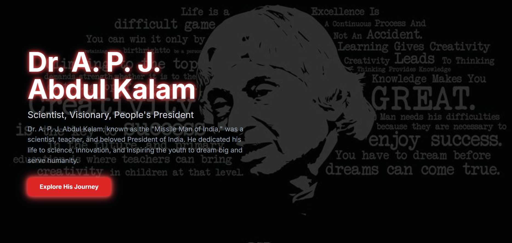

## 🙏 Tribute Page – Dr. A. P. J. Abdul Kalam

A responsive, clean, and interactive Tribute Page dedicated to Dr. A. P. J. Abdul Kalam – “The Missile Man of India”.
Built using HTML, CSS, and JavaScript, this project is a heartfelt way to practice frontend development while honoring one of the greatest visionaries of our nation.

---

## 🚀 Live Demo  

🔗 [Try it here](https://kunal-web3.github.io/Tribute-Page/)

---

## 🛠️ Tech Stack

HTML5 – structure & semantic elements  
CSS3 – responsive design & styling  
JavaScript (ES6) – interactive elements  

---

## 📂 Project Structure

OIBSIP-Tribute-Page/ 

├── index.html # Main tribute page  
├── style.css # Stylesheet (layout, responsiveness, design)  
├── script.js # Interactive elements  
├── images/ # Images of Dr. A. P. J. Abdul Kalam  
└── README.md # Project documentation  

---

## 📸 Preview :

---

## ✨ Features :

📱 Responsive layout – works across all screen sizes  
🎨 Modern design – clean UI with images & styled sections  
🖼️ Hero section with circular image & inspiring heading  
📜 Timeline section showcasing life achievements  
💡 Quotes section for motivation  
🌗 Optional background styling & theme customization  

---

## 🎯 Learning Outcomes 

Through this project, I practiced:

-📌 Designing a tribute page layout with semantic HTML  
-📌 Styling with CSS Grid, Flexbox, and media queries  
-📌 Adding interactivity with JavaScript  
-📌 Improving UI/UX design sense through real-life inspiration  

---

## 📢 Connect with Me  

🔗 [LinkedIn](https://www.linkedin.com/in/kunal-jadhav-kj) | 🌐 [GitHub](https://github.com/kunal-web3)

